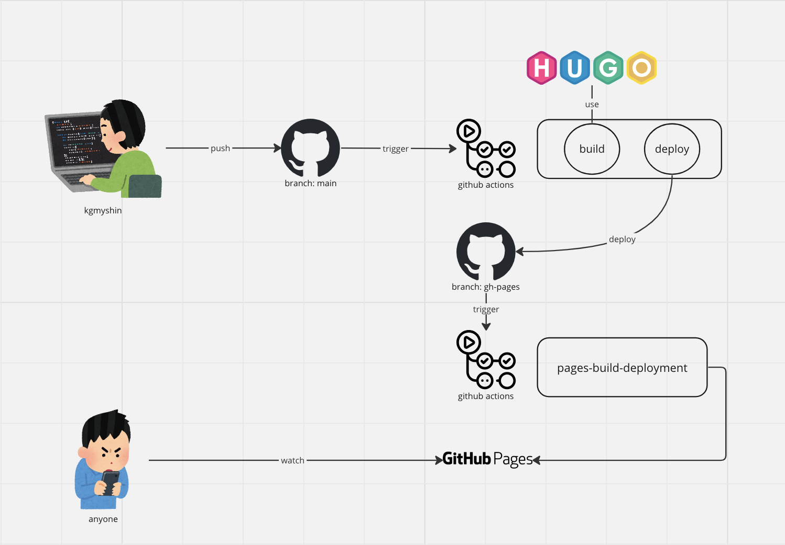

# kgmyshin blog

## 新しいブログを書く

```
hugo new content posts/{日付}.md
```

例:

```
hugo new content posts/2023-10-21.md
```

## ローカルで見た目確認

```
hugo server --buildDrafts
```

## 公開

PR を作り、準備が完了したら main ブランチにマージ。
マージすると公開されます。


